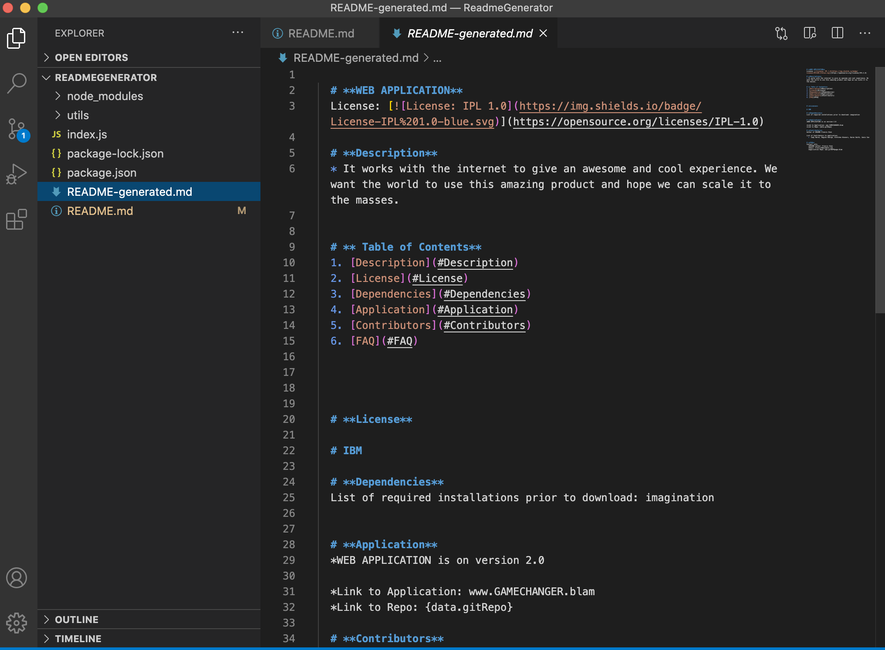
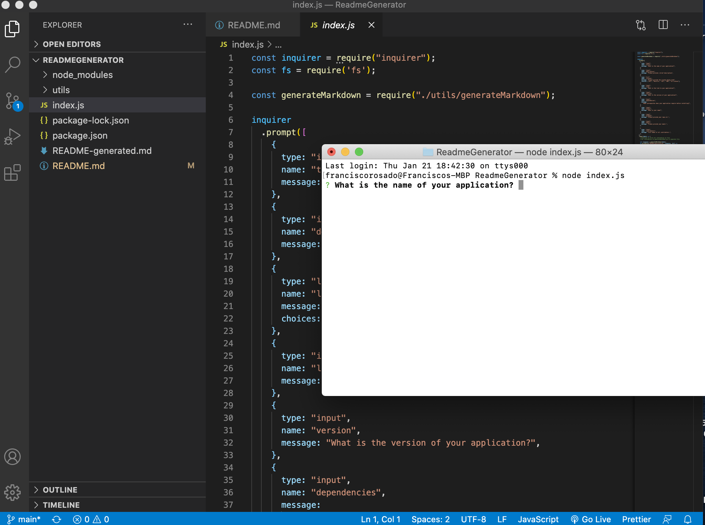

# 09 Node.js Homework: Professional README Generator

## Screenshots



## The Task


Create a README file by using a command-line application to generate one. This allows the project creator to devote more time to working on the project.

Create a command-line application that dynamically generates a professional README.md file from a user's input using the [Inquirer package](https://www.npmjs.com/package/inquirer). 


## User Story

```md
AS A developer
I WANT a README generator
SO THAT I can quickly create a professional README for a new project
```

## Links

link to github: https://github.com/Franciscorosado09/ReadmeGenerator

Link to video: https://drive.google.com/file/d/1zcKFswqg1B1mg7wqxRYoqspIPxYJ_xX4/view


## Mock-Up

    * Startercode GW Bootcamp
    * W3 schools, Stackoverflow, BCS, and WebMd 
    *Feedback, brainstorming, and general support to study group
        1. Young Ji Kim - https://github.com/youjmi
        2. Amir Ashtiany - https://github.com/Alexfit4
        3. Johnnie Simpson - https://github.com/balokdecoy
        4. Rachel Wanke - https://github.com/rwanke14

 For clarification feel free to reach out to Francisco Rosado, Franciscorosado09@.gmail.com
 


